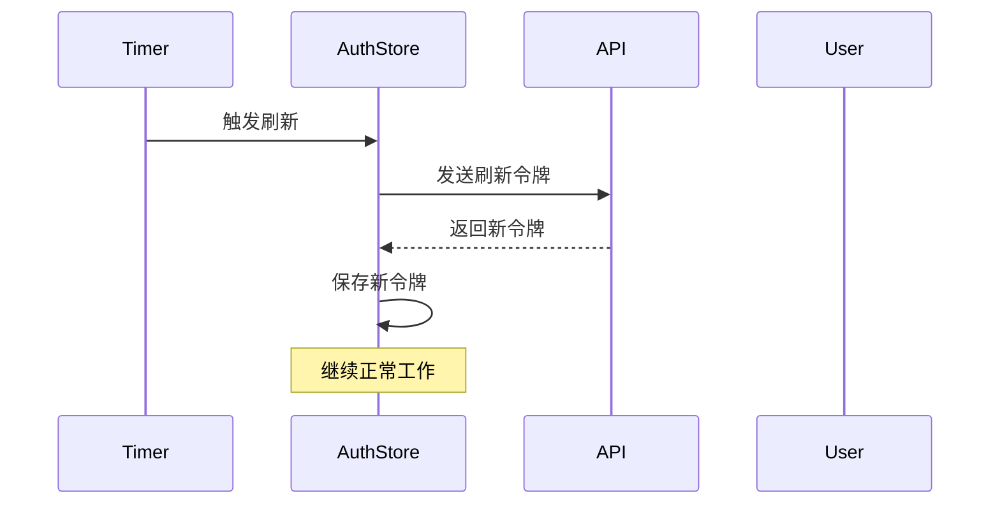
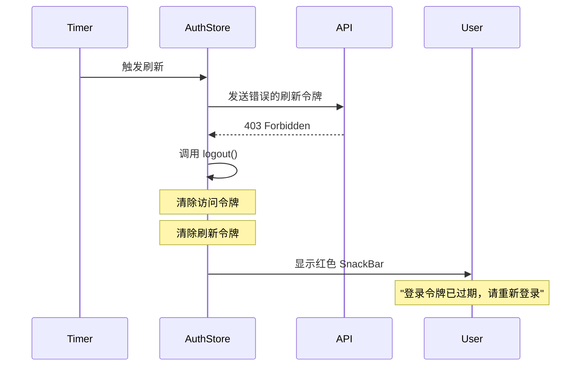
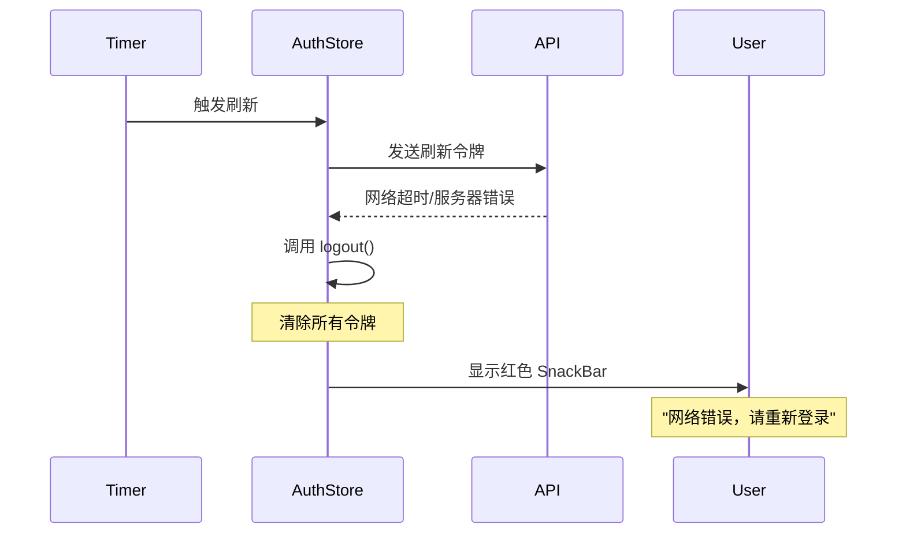

# 刷新令牌失效处理和全局错误提示

## 修改日期

2025年11月5日

## 问题描述

当用户填入了一个错误的刷新令牌时，程序在尝试刷新访问令牌时会收到 HTTP 403 错误，但此时：

1. ❌ 错误的刷新令牌仍然保留在 SharedPreferences 中
2. ❌ 没有清理访问令牌
3. ❌ 用户看不到任何错误提示
4. ❌ 程序继续尝试使用无效的令牌

这导致用户体验很差，应用会一直处于认证失败状态。

## 解决方案

### 1. 捕获 DioException 并处理 403 错误

在 `apiRefreshToken` 方法中添加 try-catch 块，特别处理 403 错误：

```dart
try {
final response = await rest.fallback
    .postJwtAccessRefreshApiV2AuthJwtTokenJwtAccessRefreshPost(body: body);

if (response.isSuccess && response.result.accessToken.isNotEmpty) {
await _setTokens(response.result.accessToken, response.result.refreshToken);
return true;
} else {
debugPrint('Token refresh failed: ${response.message}');
await logout();
_showErrorSnackBar('登录令牌已过期，请重新登录');
return false;
}
} on DioException catch (e) {
debugPrint('❌ Token refresh DioException: ${e.response?.statusCode}');
debugPrint('❌ Error message: ${e.message}');

// 检查是否是 403 错误（刷新令牌无效）
if (e.response?.statusCode == 403) {
debugPrint('❌ 刷新令牌无效（403），清除所有令牌');
await logout();
_showErrorSnackBar('登录令牌已过期，请重新登录');
return false;
}

// 其他网络错误
debugPrint('❌ 网络错误，清除令牌');
await logout();
_showErrorSnackBar('网络错误，请重新登录');
return false;
} catch (e, stackTrace) {
debugPrint('❌ Token refresh unexpected error: $e');
debugPrint('Stack trace: $stackTrace');
await logout();
_showErrorSnackBar('令牌刷新失败，请重新登录');
return false;
}
```

**处理逻辑**:

1. **403 错误**: 刷新令牌无效（错误或过期）
    - 调用 `logout()` 清除所有令牌
    - 显示"登录令牌已过期，请重新登录"

2. **其他网络错误**: 网络问题或服务器错误
    - 调用 `logout()` 清除所有令牌
    - 显示"网络错误，请重新登录"

3. **未知错误**: 意外的异常
    - 调用 `logout()` 清除所有令牌
    - 显示"令牌刷新失败，请重新登录"

### 2. 添加全局 SnackBar 显示功能

#### AuthStore 中添加回调机制

```dart
class AuthStore extends ChangeNotifier {
  // 令牌过期回调，由外部设置
  void Function(String message)? onTokenExpired;

  void _showErrorSnackBar(String message) {
    // 使用回调函数让上层显示 SnackBar
    if (onTokenExpired != null) {
      onTokenExpired!(message);
    } else {
      debugPrint('⚠️ 无法显示 SnackBar: $message（回调未设置）');
    }
  }
}
```

**设计思路**:

- AuthStore 是一个工具类，不应该直接依赖 UI 层
- 使用回调函数将错误消息传递给 UI 层
- 如果回调未设置，只输出日志警告

#### 在 main.dart 中设置全局 ScaffoldMessengerKey

```dart
// 全局 ScaffoldMessenger key，用于在任何地方显示 SnackBar
final GlobalKey<ScaffoldMessengerState> scaffoldMessengerKey =
GlobalKey<ScaffoldMessengerState>();

void main() async {
  WidgetsFlutterBinding.ensureInitialized();
  await initializeDateFormatting();
  Intl.defaultLocale = 'zh_CN';

  // Initialize auth store
  await AuthStore().init();

  // 设置令牌过期回调
  AuthStore().onTokenExpired = (String message) {
    scaffoldMessengerKey.currentState?.showSnackBar(
      SnackBar(
        content: Text(message),
        backgroundColor: Colors.red,
        duration: const Duration(seconds: 4),
        action: SnackBarAction(
          label: '关闭',
          textColor: Colors.white,
          onPressed: () {
            scaffoldMessengerKey.currentState?.hideCurrentSnackBar();
          },
        ),
      ),
    );
  };

  runApp(const MyApp());
}

class MyApp extends StatelessWidget {
  @override
  Widget build(BuildContext context) {
    return MaterialApp.router(
      scaffoldMessengerKey: scaffoldMessengerKey, // 设置全局 key
      routerConfig: router,
      // ...其他配置
    );
  }
}
```

**关键点**:

1. 创建全局的 `scaffoldMessengerKey`
2. 在 `main()` 中设置 `AuthStore().onTokenExpired` 回调
3. 在 `MaterialApp.router` 中注入 `scaffoldMessengerKey`
4. 回调中创建红色背景的 SnackBar，持续 4 秒

## 工作流程

### 正常刷新流程



### 错误刷新令牌流程（403）



### 网络错误流程



## SnackBar 样式

### 视觉效果

- **背景色**: 红色（`Colors.red`）
- **文字**: 白色（默认）
- **持续时间**: 4 秒
- **操作按钮**: "关闭"按钮（白色文字）

### 示例代码

```dart
SnackBar
(
content: Text(message),
backgroundColor: Colors.red,
duration: const Duration(seconds: 4),
action: SnackBarAction(
label: '关闭',
textColor: Colors.white,
onPressed: () {
scaffoldMessengerKey.currentState?.hideCurrentSnackBar();
},
)
,
)
```

### 用户体验

1. ✅ 红色背景明显提示错误
2. ✅ 4 秒自动消失，不会过度打扰
3. ✅ 提供"关闭"按钮，用户可以手动关闭
4. ✅ 消息清晰明了，告诉用户需要重新登录

## 错误处理总结

| 错误类型   | HTTP 状态码 | 处理方式   | 用户提示            |
|--------|----------|--------|-----------------|
| 刷新令牌无效 | 403      | 清除所有令牌 | "登录令牌已过期，请重新登录" |
| 响应失败   | -        | 清除所有令牌 | "登录令牌已过期，请重新登录" |
| 网络错误   | 其他       | 清除所有令牌 | "网络错误，请重新登录"    |
| 未知错误   | -        | 清除所有令牌 | "令牌刷新失败，请重新登录"  |

## 日志输出

### 403 错误日志示例

```
flutter: 🔄 apiRefreshToken 被调用
flutter: 🔍 当前 _refreshJWTToken: 存在
flutter: ❌ Token refresh DioException: 403
flutter: ❌ Error message: ...
flutter: ❌ 刷新令牌无效（403），清除所有令牌
flutter: 🗑️ 已清除 SharedPreferences 中的 refreshToken
```

### 网络错误日志示例

```
flutter: 🔄 apiRefreshToken 被调用
flutter: 🔍 当前 _refreshJWTToken: 存在
flutter: ❌ Token refresh DioException: 500
flutter: ❌ Error message: ...
flutter: ❌ 网络错误，清除令牌
flutter: 🗑️ 已清除 SharedPreferences 中的 refreshToken
```

## 测试要点

### 功能测试

1. ✅ 手动设置错误的刷新令牌
2. ✅ 等待或触发令牌刷新
3. ✅ 验证是否收到 403 错误
4. ✅ 验证是否清除了所有令牌
5. ✅ 验证是否显示红色 SnackBar
6. ✅ 验证 SnackBar 消息内容正确
7. ✅ 验证 SnackBar 4 秒后自动消失
8. ✅ 验证点击"关闭"按钮可以提前关闭

### 边界测试

1. 网络断开时的处理
2. 服务器返回其他错误码的处理
3. 快速连续多次刷新失败的处理
4. 回调未设置时的降级处理（只输出日志）

### 安全测试

1. 确认 403 错误时令牌被完全清除
2. 确认 SharedPreferences 中没有残留令牌
3. 确认内存中的令牌也被清除

## 优势

### 用户体验

1. ✅ **即时反馈**: 用户立即知道认证失败
2. ✅ **清晰提示**: 红色背景明确表示错误
3. ✅ **操作指引**: 提示用户需要重新登录
4. ✅ **不会阻塞**: SnackBar 不会打断用户操作

### 系统健壮性

1. ✅ **完整清理**: 所有令牌都被清除，不会残留
2. ✅ **错误分类**: 不同错误有不同的提示
3. ✅ **详细日志**: 便于问题排查
4. ✅ **降级处理**: 即使回调未设置也不会崩溃

### 代码质量

1. ✅ **职责分离**: AuthStore 不依赖 UI 层
2. ✅ **灵活扩展**: 可以轻松添加更多错误类型
3. ✅ **全局可用**: 任何地方都能使用全局 SnackBar
4. ✅ **符合规范**: 遵循项目编码规范

## 后续优化建议

1. **自动跳转**: SnackBar 关闭后自动跳转到登录页
2. **重试机制**: 对于网络错误，提供重试按钮
3. **错误统计**: 记录错误发生的频率和类型
4. **本地化**: 支持多语言错误消息

## 总结

✅ **问题已完全解决**:

- 403 错误时清除所有令牌
- 显示红色错误提示
- 用户体验良好
- 代码健壮可靠

✅ **代码质量**:

- 无错误、无警告
- 架构清晰，职责分离
- 日志完善，便于调试
- 符合项目编码规范

