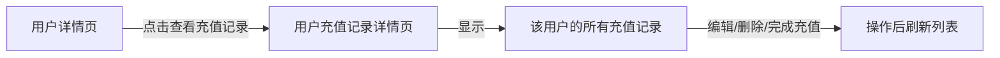

# 用户充值记录详情页面API更新

## 日期

2025年11月19日

## 操作说明

### 背景

与充值记录列表页面一样，用户充值记录详情页面也需要更新为使用新的 `q` 参数API。

### 改动内容

#### API参数变更

**原API调用：**

```dart

final result = await
_restClient.fallback
    .getUserPayListApiV2LowAdminApiUserPayListGet
(
limit: _pageLimit,
offset: _offset,
userId: widget.
userId
, // ❌ 已废弃
);
```

**新API调用：**

```dart

final result = await
_restClient.fallback
    .getUserPayListApiV2LowAdminApiUserPayListGet
(
limit: _pageLimit,
offset: _offset,
q: 'user_id:${widget.userId}', // ✅ 使用q参数
);
```

### 页面功能

这个页面是从用户详情页跳转过来的，专门显示某个用户的充值记录。

#### 保留的功能

- ✅ 显示指定用户的所有充值记录
- ✅ 分页加载（每页50条）
- ✅ 下拉刷新
- ✅ 自动加载更多
- ✅ 编辑充值记录
- ✅ 删除充值记录
- ✅ 完成充值操作
- ✅ 复制交易单号
- ✅ 复制记录ID
- ✅ 显示完成状态标签

#### 充值记录卡片信息

每条记录包含：

**基本信息：**

- 交易单号（可点击复制）
- 记录ID（可点击复制）
- 完成状态（已完成/未完成）

**详细信息：**

- 用户ID
- 金额
- 支付方式
- 创建时间（本地时间）
- 更新时间（本地时间）
- 发票ID（如果有）
- 备注（如果有）

**操作按钮：**

- 完成充值（仅未完成的记录显示）
- 编辑
- 删除

### 与充值记录列表页面的区别

| 特性   | 用户充值记录详情页   | 充值记录列表页     |
|------|-------------|-------------|
| 用途   | 查看单个用户的充值记录 | 查看所有用户的充值记录 |
| 用户ID | 固定（从路由参数获取） | 可搜索（通过q参数）  |
| 导航方式 | 从用户详情页跳转    | 直接访问或从菜单进入  |
| 搜索框  | ❌ 无         | ✅ 有         |
| 编辑功能 | ✅ 有         | ❌ 无         |
| 删除功能 | ✅ 有         | ❌ 无         |
| 完成充值 | ✅ 有         | ✅ 有         |

### 导航流程



### API调用示例

```dart
// 页面初始化时
// widget.userId = 123

// API请求
GET /api/v2/low_admin_api/user_pay_list/?q=user_id:123&limit=50&offset=0
```

### 编辑功能

用户可以编辑充值记录的以下字段：

- 金额（必填）
- 交易单号（必填）
- 支付方式ID（必填）
- 发票ID（可选）
- 备注（可选）
- 是否完成（开关）

编辑对话框包含验证：

- 金额不能为空
- 交易单号不能为空
- 支付方式ID必须是有效数字

### 完成充值流程

1. 用户点击"完成充值"按钮
2. 显示确认对话框，包含：
    - 交易单号
    - 用户ID
    - 金额
3. 用户确认后调用API
4. 显示处理中提示
5. 成功后显示绿色提示
6. 自动刷新列表

### 时间处理

与其他页面一样，正确处理UTC和本地时间：

```dart
// 显示时间时转换为本地时间
dateFormat.format
(
tz.TZDateTime.from(record.createdAt!, tz
.
local
)
,
)
```

### 代码修改

**修改行数：** 1处
**修改内容：** API调用参数从 `userId` 改为 `q: 'user_id:${widget.userId}'`

### 测试检查清单

- [x] 从用户详情页跳转到充值记录页面
- [x] 正确显示该用户的充值记录
- [x] 分页加载功能正常
- [x] 下拉刷新功能正常
- [x] 编辑充值记录功能正常
- [x] 删除充值记录功能正常
- [x] 完成充值功能正常
- [x] 复制交易单号功能正常
- [x] 复制记录ID功能正常
- [x] 完成充值后自动刷新列表

### 总结

此次修复实现了：

- ✅ **API适配** - 从 `userId` 参数改为 `q` 参数
- ✅ **功能保持** - 所有现有功能正常工作
- ✅ **代码一致** - 与其他页面使用相同的API参数格式
- ✅ **向后兼容** - 不影响用户体验

用户充值记录详情页面现在完全适配了新的API！

