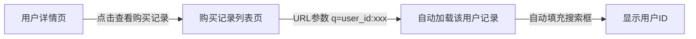

# 购买记录查询API参数更新

## 日期

2025年11月19日

## 操作说明

### 背景

后端API已更新，购买记录查询从使用 `userId` 参数改为使用通用查询参数 `q`。

原API调用方式：

```bash
GET /api/v2/low_admin_api/user_bought/?user_id=18401&offset=0&limit=50
```

新API调用方式：

```bash
GET /api/v2/low_admin_api/user_bought/?q=user_id:18401&offset=0&limit=3000
```

### 改动内容

#### 1. 更新 BoughtRecordsListComponent 组件

**文件路径**: `/lib/component/bought_records/bought_records_list_component.dart`

##### 参数变更

```dart
// 旧参数
class BoughtRecordsListComponent extends StatefulWidget {
  final int? userId; // ❌ 已废弃
// ...
}

// 新参数
class BoughtRecordsListComponent extends StatefulWidget {
  final String? q; // ✅ 使用查询字符串
// ...
}
```

##### API调用变更

```dart
// 旧调用
final result = await
_restClient.fallback
    .getUserBoughtApiV2LowAdminApiUserBoughtGet
(
userId: widget.userId, // ❌ 已废弃
);

// 新调用
final result = await _restClient.fallback
    .getUserBoughtApiV2LowAdminApiUserBoughtGet(
q: widget.
q
, // ✅ 使用q参数
);
```

#### 2. 更新用户购买记录页面

**文件路径**: `/lib/page/low_admin/user_bought_records/low_admin_user_bought_records_page.dart`

```dart
// 旧实现
BoughtRecordsListComponent
(
userId: userId, // ❌
isShowActions: true,
isEnableUserIdNavigation: false,
)

// 新实现
BoughtRecordsListComponent(
q: 'user_id:$userId', // ✅ 使用查询字符串格式
isShowActions: true,
isEnableUserIdNavigation: false,
)
```

#### 3. 更新购买记录列表页面

**文件路径**: `/lib/page/low_admin/user_bought_list/low_admin_user_bought_list_page.dart`

##### 状态管理变更

```dart
class _LowAdminUserBoughtListPageState extends State<LowAdminUserBoughtListPage> {
  // 旧实现
  int? _filterUserId; // ❌

  // 新实现
  String? _queryString; // ✅
}
```

##### 搜索逻辑变更

```dart
void _searchByUserId() {
  final text = _userIdController.text.trim();
  setState(() {
    // 旧实现
    // _filterUserId = text.isEmpty ? null : int.tryParse(text);  // ❌

    // 新实现
    if (text.isEmpty) {
      _queryString = null;
    } else {
      final userId = int.tryParse(text);
      if (userId != null) {
        _queryString = 'user_id:$userId'; // ✅ 格式化为查询字符串
      } else {
        _queryString = null;
      }
    }
  });
}
```

##### 添加URL参数读取功能

```dart
@override
void initState() {
  super.initState();
  // 从URL查询参数中读取q参数
  WidgetsBinding.instance.addPostFrameCallback((_) {
    _loadQueryFromUrl();
  });
}

void _loadQueryFromUrl() {
  final uri = GoRouterState
      .of(context)
      .uri;
  final qParam = uri.queryParameters['q'];
  if (qParam != null && qParam.isNotEmpty) {
    // 解析 user_id:xxx 格式
    if (qParam.startsWith('user_id:')) {
      final userId = qParam.substring('user_id:'.length);
      _userIdController.text = userId;
    }
    setState(() {
      _queryString = qParam;
    });
  }
}
```

##### 组件调用变更

```dart
BoughtRecordsListComponent
(
key: ValueKey(_queryString), // 使用queryString作为key
q: _queryString, // ✅ 传递查询字符串
isShowActions
:
false
,
isEnableUserIdNavigation
:
true
,
)
```

#### 4. 更新用户详情页导航

**文件路径**: `/lib/page/low_admin/user_detail/low_admin_user_detail_page.dart`

##### 导航方式变更

```dart
// 旧实现 - 导航到单独的用户购买记录页面
Future<void> _navigateToBoughtRecords() async {
  await Navigator.of(context).push(
    MaterialPageRoute(
      builder: (context) =>
          LowAdminUserBoughtRecordsPage(userId: widget.userId),
    ),
  );
}

// 新实现 - 导航到购买记录列表页面并带上查询参数
Future<void> _navigateToBoughtRecords() async {
  context.go('/low_admin/user_bought?q=user_id:${widget.userId}');
}
```

### 查询字符串格式

新的 `q` 参数支持以下格式：

| 查询类型    | 格式示例             | 说明            |
|---------|------------------|---------------|
| 按用户ID查询 | `user_id:18401`  | 查询指定用户的购买记录   |
| 按订单ID查询 | `order_id:12345` | 查询指定订单（未来可扩展） |
| 空查询     | `null` 或不传       | 查询所有购买记录      |

### 用户体验优化

#### 1. URL参数持久化

用户从其他页面跳转到购买记录列表时，查询条件会保留在URL中：

```
/low_admin/user_bought?q=user_id:18401
```

优点：

- ✅ 刷新页面后查询条件不丢失
- ✅ 可以分享URL给其他管理员
- ✅ 浏览器前进/后退按钮工作正常

#### 2. 自动填充搜索框

当从URL参数中读取到 `user_id:xxx` 时，会自动填充到搜索框中，用户可以直观地看到当前的筛选条件。

#### 3. 导航流程



### API定义（参考）

```dart
@GET('/api/v2/low_admin_api/user_bought/')
Future<WebSubFastapiRoutersApiVLowAdminApiUserBoughtGetUserBoughtResponse>
getUserBoughtApiV2LowAdminApiUserBoughtGet({
  @Query('offset') int? offset = 0,
  @Query('limit') int? limit = 3000,
  @Query('q') String? q, // ✅ 新增查询参数
  @Query('from_iso') DateTime? fromIso,
  @Query('to_iso') DateTime? toIso,
});
```

### 向后兼容性

虽然组件参数从 `userId` 改为 `q`，但由于组件是内部使用的，不影响外部API。所有调用该组件的地方都已同步更新。

### 测试检查清单

- [x] 购买记录列表页面正常加载所有记录
- [x] 在列表页面搜索特定用户ID
- [x] 从用户详情页点击"查看购买记录"
- [x] URL参数正确传递（`?q=user_id:xxx`）
- [x] 刷新页面后筛选条件保持
- [x] 清空搜索后显示所有记录
- [x] 编辑和删除功能正常
- [x] 订单ID复制功能正常

### 后续扩展可能性

新的 `q` 参数设计为通用查询参数，可以轻松扩展支持更多查询类型：

1. **按商品名称搜索**
   ```
   q=shop_name:VIP会员
   ```

2. **按日期范围搜索**
   ```
   q=date_range:2025-01-01,2025-12-31
   ```

3. **复合查询**
   ```
   q=user_id:123,status:active
   ```

4. **模糊搜索**
   ```
   q=search:关键词
   ```

### 总结

此次更新主要是：

- ✅ 统一使用 `q` 参数进行查询
- ✅ 支持URL查询参数持久化
- ✅ 优化用户导航体验
- ✅ 为未来功能扩展打下基础
- ✅ 保持代码简洁和一致性

所有更改均遵循项目编码规范，使用Model参数调用API，避免手动构造查询字符串。

